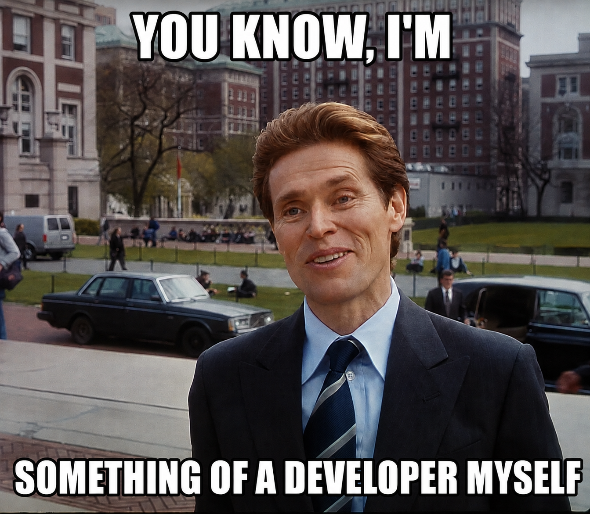

  

  <strong>System Analyst with hands-on commercial development experience.</strong>

  I work at the intersection of requirements, system behavior, integrations and implementation. 
  My focus is on analysis that can survive contact with real systems, real constraints and real code.

  <a href="./README.md"><strong>EN</strong></a>
  &nbsp;·&nbsp;
  <a href="./README_RU.md">RU</a>

  

---

## Featured Projects

<table>
<tr>

<td width="50%" valign="top">

<h3>Enterprise Workplace OS Migration</h3>

<strong>System analysis of a large-scale enterprise workplace migration.</strong>

Requirements, dependency analysis, rollout logic, migration states,
process modeling and technical artifacts for a phased
Windows → Astra Linux migration.

</td>

<td width="50%" valign="top">

<h3>Aveli</h3>

<strong>System analysis of an offline-first mobile workspace.</strong>

Mobile architecture, local data ownership, REST API boundaries,
authentication and access, subscription billing, offline behavior
and traceability for a real Flutter-based product.

</td>

</tr>

<tr>

<td width="50%" valign="top">

<h3>Rebar AutoDim</h3>

<strong>System analysis and solution design for Autodesk Revit 2025 automation.</strong>

AS-IS / TO-BE, requirements, geometry processing, directional grid
selection, placement logic, Revit API interaction, errors,
idempotency and traceability.

</td>

<td width="50%" valign="top">

<h3>Full Portfolio</h3>

<strong>Curated system-analysis cases across different system types.</strong>

Enterprise IT, mobile architecture and BIM automation —
with requirements, diagrams, business rules, data models,
integrations and traceability.

</td>

</tr>
</table>

---

## About Me

I combine system analysis with practical software development.

My background includes enterprise IT, technical solution design, process formalization and implementation of production software.

I focus on:

- system and integration analysis;
- requirements engineering and business rules;
- API and contract design;
- data and process modeling;
- system behavior and state models;
- implementation-aware solution design.

> I prefer analysis that can be implemented — requirements, contracts and architecture should remain valid when they reach real code.

---

## Education

<table>
<tr>
<td width="70%" valign="top">

<strong>Moscow State University of Technology and Management</strong> 
Institute of Economics and Business 
Accounting, Analysis and Audit

</td>

<td width="30%" align="right" valign="top">

<strong>Higher Education</strong> 
Graduation: 2026

</td>
</tr>
</table>

## System Analysis Toolkit

  
  
  
  
  
  
  
  

### Tools

  
  
  
  
  

---

## Development Stack

  
  
  
  
  
  
  
  
  

---

## Areas of Focus

  
  
  
  
  
  
  
  
  
  

---

## Contact

  

  

  

  Open to system analysis, integration and architecture opportunities.

